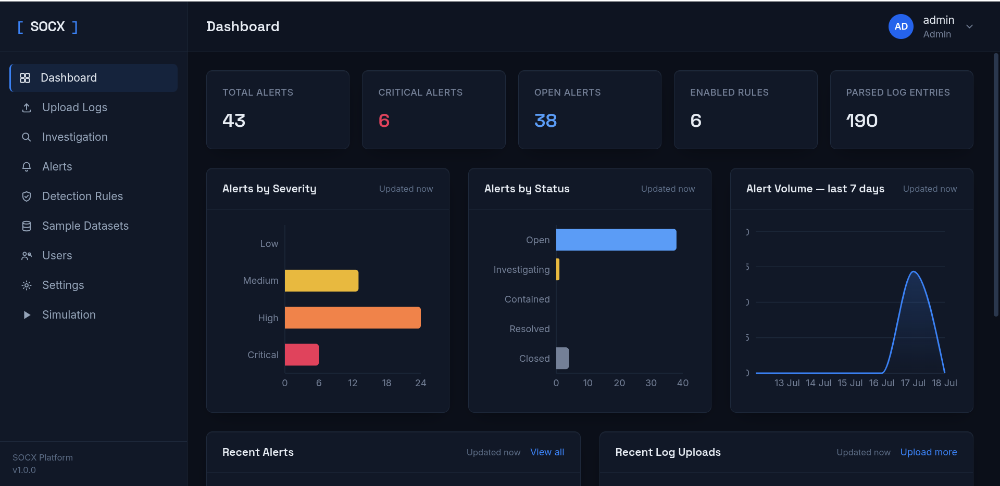
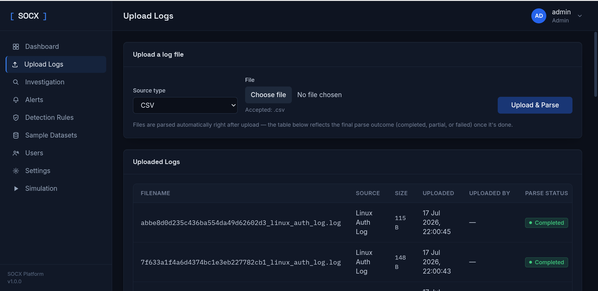
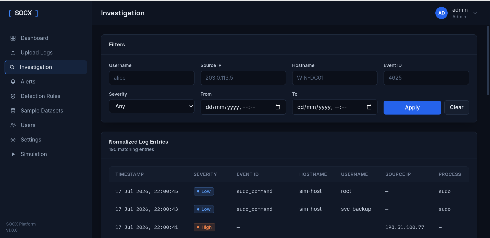
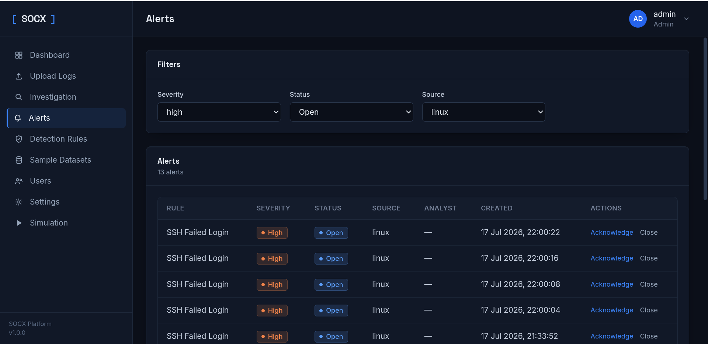
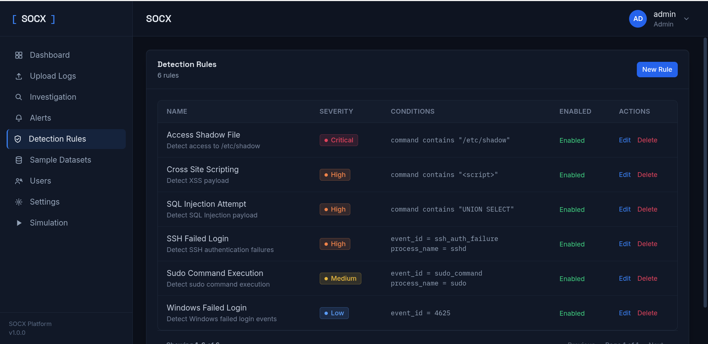
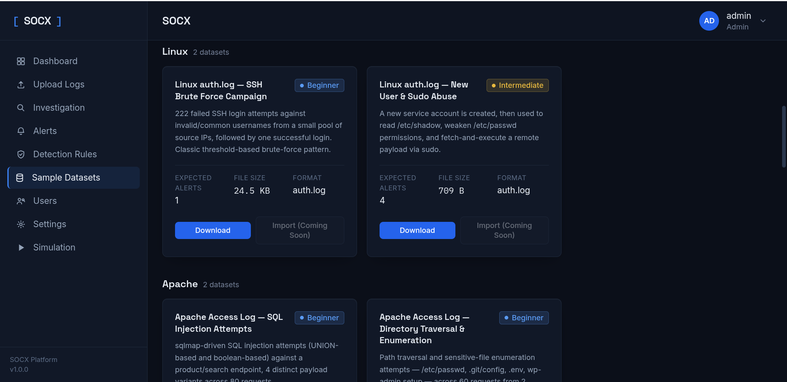
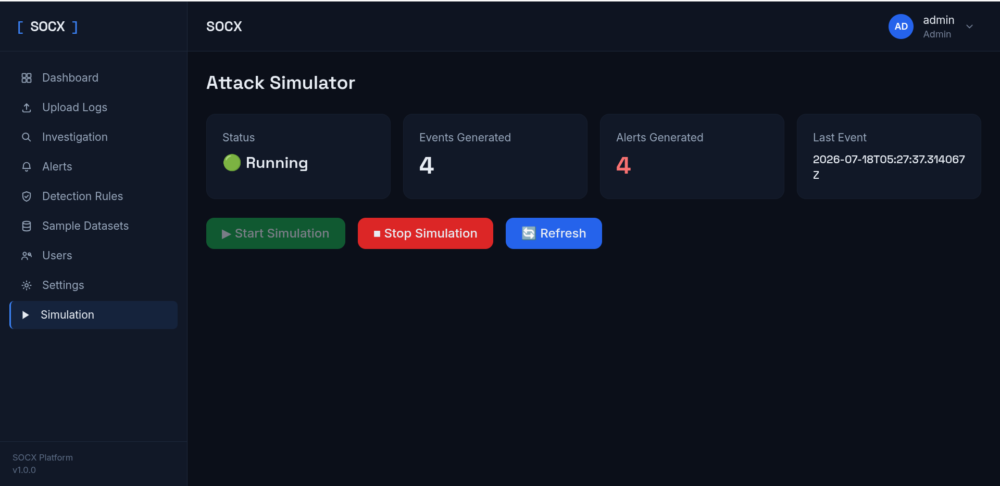
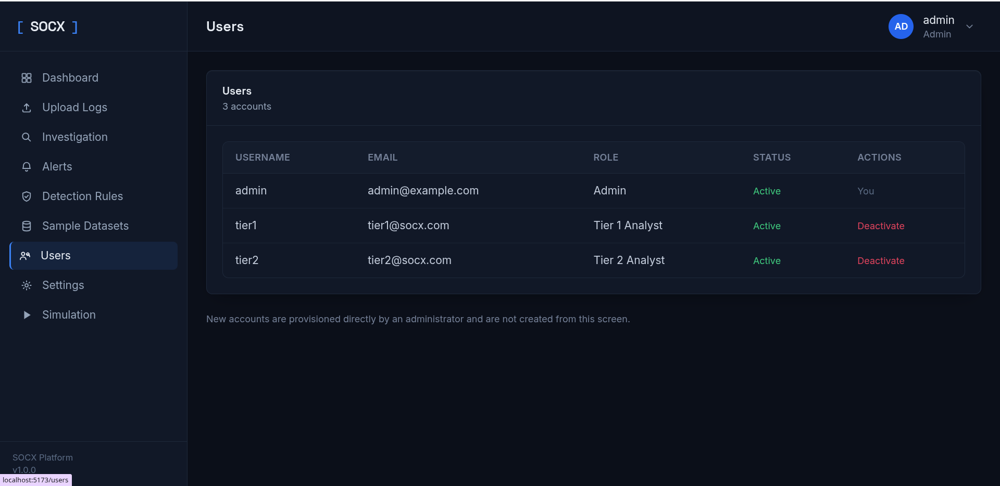
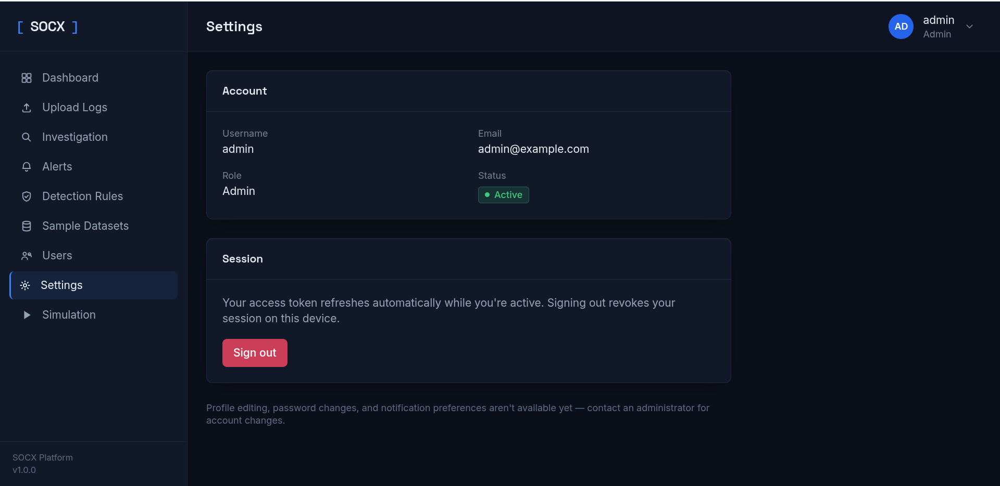

<div align="center">

# 🛡️ SOCX
### Security Operations Center (SOC) Monitoring & Incident Response Platform

*A full-stack Security Operations Center (SOC) platform for monitoring, detecting, investigating, and responding to cybersecurity incidents. Built using FastAPI, React, and PostgreSQL to simulate real-world SOC workflows for learning, practice, and demonstration.*


</div>

---

# 📖 Overview

SOCX is a full-stack Security Operations Center (SOC) platform designed to simulate the workflow of a real-world Security Operations Center.

The platform enables security analysts to upload and analyze security logs, detect suspicious activities using configurable detection rules, investigate alerts, and manage incidents through a centralized dashboard.

SOCX combines authentication, role-based access control (RBAC), log parsing, alert management, attack simulation, and investigation into a single platform, making it ideal for cybersecurity learning, demonstrations, and portfolio projects.

---

# ✨ Features

- 🔐 JWT Authentication & Secure Login
- 👥 Role-Based Access Control (Admin, Tier 1 Analyst, Tier 2 Analyst)
- 📊 Interactive Security Dashboard
- 📂 Multi-Source Log Upload & Parsing
- 🪟 Windows Event Log Support
- 🐧 Linux Authentication Log Support
- 🌐 Apache & Nginx Log Parsing
- 📄 CSV Log Support
- 🚨 Detection Rule Engine
- 🔔 Alert Generation & Management
- 🔍 Investigation Module
- ⚔️ Attack Simulator
- 👤 User Management
- 📁 Sample Security Datasets

---

# 🛠️ Tech Stack

### Frontend
- React.js
- Vite
- Tailwind CSS
- Axios
- React Router

### Backend
- FastAPI
- SQLAlchemy
- JWT Authentication
- Pydantic

### Database
- PostgreSQL

---

# 🏗️ System Architecture

```text
             ⚔️ Attack Simulator
                     │
                     ▼
              📂 Log Collection
                     │
                     ▼
               🔎 Log Parsing
                     │
                     ▼
             🧠 Detection Engine
                     │
                     ▼
             📋 Detection Rules
                     │
                     ▼
              🚨 Alert Manager
                     │
                     ▼
             🔍 Investigation
                     │
                     ▼
          🛡️ Incident Response
```

---

# 📸 Application Preview

## 📊 Dashboard

The dashboard provides an overview of alerts, uploaded logs, detection rules, and platform statistics.



---

## 📂 Upload Logs

Upload Windows, Linux, Apache, Nginx, and CSV logs for automated parsing and analysis.



---

## 🔍 Investigation

Search and investigate normalized log entries using multiple filters.



---

## 🚨 Alert Management

Monitor, acknowledge, investigate, and close security alerts.



---

## 🛡️ Detection Rules

Create and manage custom detection rules to identify suspicious activities.



---

## 📁 Sample Security Datasets

Download pre-built datasets to quickly test the detection engine.



---

## ⚔️ Attack Simulator

Generate simulated cyber attacks to validate detections and alert generation.



---

## 👥 User Management

Manage analyst accounts and role-based permissions.



---

## ⚙️ Settings

Manage account information and application settings.



---

# 📂 Supported Log Sources

- Windows Event Logs
- Linux Authentication Logs
- Apache Access Logs
- Nginx Access Logs
- CSV Logs

---

# 📈 Current Modules

| Module | Status |
|---------|--------|
| Authentication | ✅ |
| RBAC | ✅ |
| Dashboard | ✅ |
| Log Upload | ✅ |
| Log Parsing | ✅ |
| Detection Rules | ✅ |
| Detection Engine | ✅ |
| Alert Management | ✅ |
| Investigation | ✅ |
| Attack Simulator | ✅ |
| User Management | ✅ |
| Sample Datasets | ✅ |

---

# 🚀 Getting Started

## Clone Repository

```bash
git clone https://github.com/sirophin/SOCX.git
cd SOCX
```

## Backend

```bash
cd socx_backend

python -m venv venv

source venv/bin/activate

pip install -r requirements.txt

uvicorn app.main:app --reload --port 8001
```

## Frontend

```bash
cd socx_frontend

npm install

npm run dev
```

---

# 🔮 Roadmap (Version 2)

- Investigation Timeline
- Analyst Notes
- IOC Extraction
- MITRE ATT&CK Mapping
- Threat Intelligence Integration
- PDF Incident Reports
- Real-Time Log Streaming
- SOAR Automation

---

# 👨‍💻 Author

**Sirophin**

Cyber Security Engineering Student

🔗 GitHub: https://github.com/sirophin

---

# 📄 License

This project is licensed under the MIT License.

---

<div align="center">

### ⭐ If you found this project useful, consider giving it a Star!

**Built with ❤️ for the Cyber Security Community**

</div>
